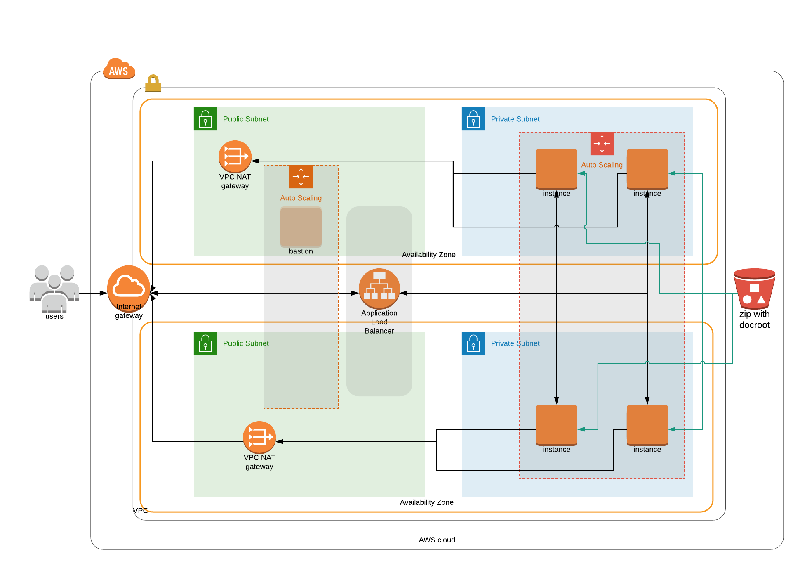

# Udacity - Deploy a High-Availability Web App using CloudFormation

## Introduction

This repository if for my second project of Udacity: Deploy a High-Availability Web App using CloudFormation.

You can find in it 3 CF stacks: network, bastion and webapp and one script do_stack.sh which is responsible for deploying all stacks.

## U-D(i)agram


 
## Deploy it

### Secure

#### Actions

##### Create:

```bash
./do_stack.sh create secure
```

##### Delete:

```bash
./do_stack.sh delete secure
```

With this first step you will:
- find your local IP and store it on aws parameter store
- Generate a SSH key (RSA 4096)
- Store the ssh key in paramater store as a secured string
- Import the key in EC2 key pair

Good you have your prerequis done!

### Network

#### Actions

##### Create: 

```bash
./do_stack.sh create network
```

##### Update: 

```bash
./do_stack.sh update network
```

##### Delete:

```bash
./do_stack.sh delete network
```


This stack is about network so you will deploy the CF stack network:

- 1 VPC
- 2 Public Subnets
- 2 Private Subnets
- Internet Gateway
- 2 NAT Gateways with EIP
- Private Routes
- Public Routes
- Default Security Group

### Bastion

#### Actions

##### Create: 

```bash
./do_stack.sh create bastion
```

##### Update: 

```bash
./do_stack.sh update bastion
```

##### Delete:

```bash
./do_stack.sh delete bastion
```

Bastion stack was not a mandatory part of the project, but a nice to have.

With this stack you'll have:

- Security Group (from local IP to port 22 on host)
- Security Group (from bastion on port 22)
- EIP for Bastion Host
- IAM Instance Profile
    - Ability to reallocate EIP
    - Get parameters from SSM (retrieve SSH Key)
- Autoscaling Group on Public Subnets
- Launch Template with user data to get SSH Key and point EIP on instance due to ASG


### WebApp

#### Actions

##### Create: 

```bash
./do_stack.sh create webapp
```

##### Update: 

```bash
./do_stack.sh update webapp
```

##### Delete:

```bash
./do_stack.sh delete webapp
```

This is the CF stack for deploying WebApp.

- Application Load Balancer
- Security Group for LB (only http in and out)
- Listener
- Listener Rule
- Target Group
- Autoscaling Group
- Launch Configuration
- IAM Role and Instance Profile
    - S3 read access
    - SSM get to retrieve SSH Public Key
- Security Group for WebApp Hosts
    - SSH from bastion
    - HTTP to be accessible from LB
- Scaling policies
- Cloudwatch alarm for CPU usage

## Website endpoint


Due to cost, this endpoint will be accessible only during the review period. But feel free to deploy it on your own!